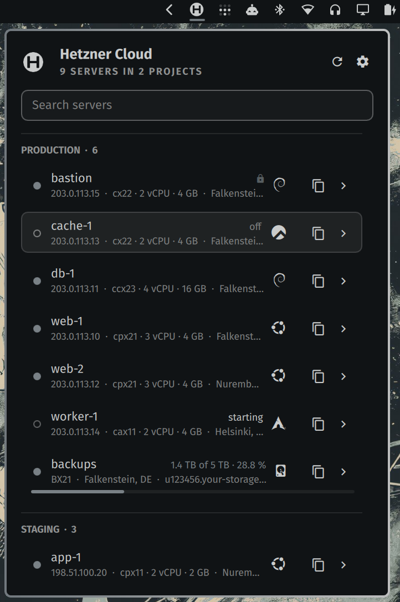
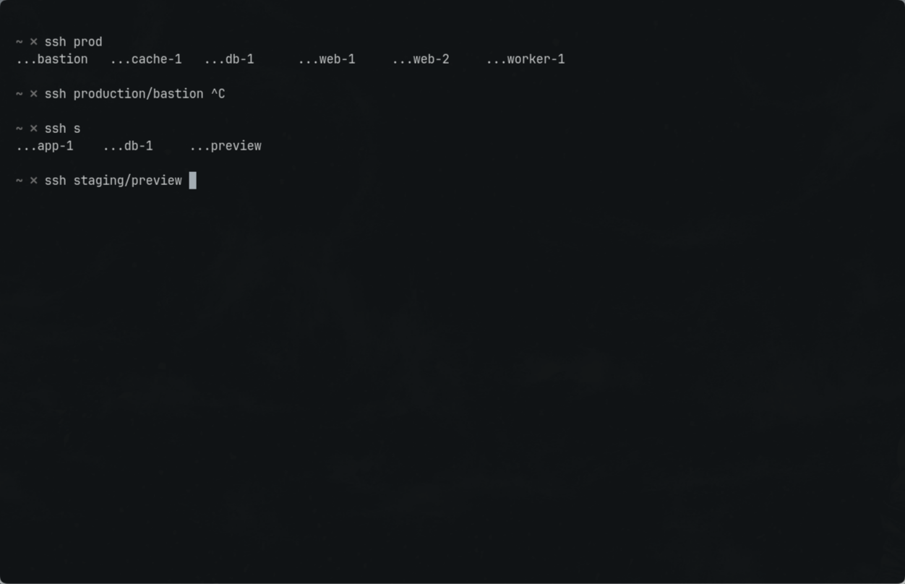
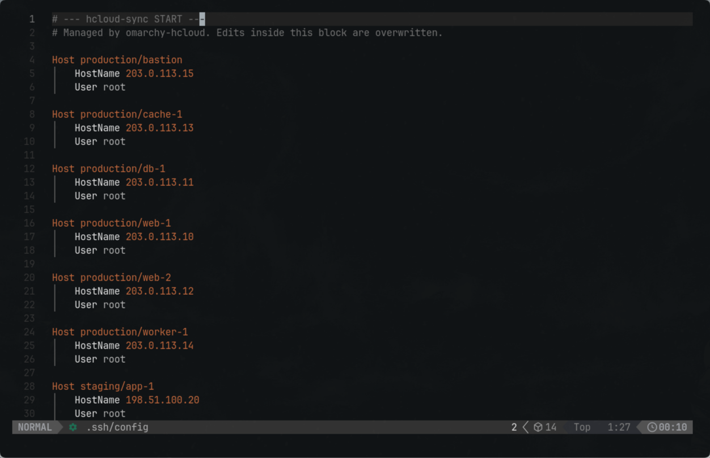
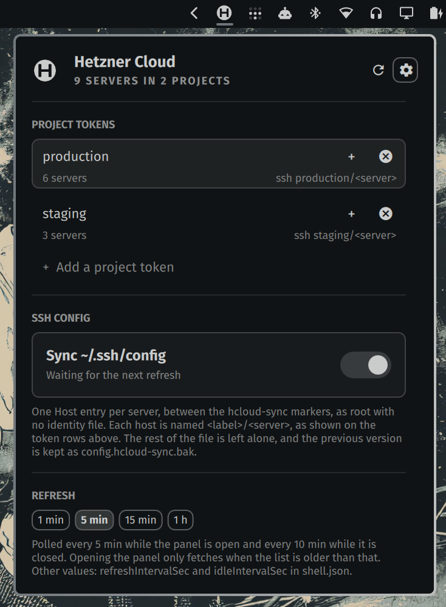

# Hetzner Cloud for the Omarchy bar

Every server in every Hetzner Cloud project, one click away in the
[Omarchy](https://omarchy.org) bar — with the addresses you keep pasting into a
terminal, the state of each machine, live CPU, and an `~/.ssh/config` that
writes itself. Read-only by design: it lists, it copies, it never powers
anything on or off.


<p align="center">
  
</p>

## Why

You have a handful of Hetzner projects and you spend your day in a terminal.
Twice an hour you open the Cloud Console to look up an IP, check whether a box
is still starting, or remember what `db-1` in staging was called on the inside.
This widget puts that in the bar, keyboard first, and turns the lookups into
`ssh production/web-1`.

- **All projects, one list.** One read-only token per project, grouped under
  labels you choose.
- **Copy, don't retype.** Click a row for its IPv4; the copy menu has the name,
  IPv6, private IP and the ssh alias.
- **SSH that just works.** Optionally keep a block in `~/.ssh/config` in step
  with your fleet — `ssh <project>/<server>` for every machine you own.
- **Know the state at a glance.** A disc before each name: filled running,
  hollow off, breathing while it changes, urgent when something is wrong.
- **What the API knows, on one page.** Image, disk, volumes with device paths,
  traffic against the included allowance, firewalls, protection, labels — and
  live CPU with a sparkline over the last hour, day or week.
- **Storage Boxes too**, with how full they are, which is the one thing a cloud
  server cannot tell you about itself.
- **Frugal with the API.** One instance polls however many monitors you have,
  the panel does not refetch on every open, and the bridge answers what it
  already knows when Hetzner is slow.
- **Your token never leaves the keyring.** No token in `shell.json`, none on a
  command line, no `Authorization` header built in QML.

## Install

```bash
omarchy plugin add https://github.com/ndrsgg/omarchy-hcloud.git --enable
omarchy restart shell
```

That runs the shell's own manifest check, clones into
`~/.config/omarchy/plugins/io.github.ndrsgg.hcloud` and asks where on the bar
to put it. Then click the Hetzner mark, give your first project a label, and
paste a token created in the Cloud Console under **Security → API tokens →
Generate** with **Read** permission.

Requires `/usr/bin/python3`, `/usr/bin/secret-tool` (libsecret) with a
running keyring, and `/usr/bin/wl-copy` for the copy actions — by those exact
paths; the plugin never looks anything up on `PATH`. Nothing is written
outside the keyring unless you turn the SSH config sync on.

<details>
<summary>Install by hand</summary>

```bash
git clone https://github.com/ndrsgg/omarchy-hcloud.git \
  ~/.config/omarchy/plugins/io.github.ndrsgg.hcloud
omarchy-shell shell rescanPlugins
omarchy bar put io.github.ndrsgg.hcloud --section right
omarchy restart shell
```

`bar put` both enables the plugin and places it. Prefer it over `plugin
enable`: for a third-party plugin, "enabled" means the id is present in
`shell.json`, so a widget that never got a layout entry is never loaded — no
icon and no error in the log. Restart the shell afterwards; a running shell
does not reliably pick up a newly placed third-party widget.
</details>

## The SSH config sync

This is the feature that pays for the rest. Turn on **Sync ~/.ssh/config** in
the panel's settings and every server with a public IPv4 gets a `Host` entry
named `<label>/<server>`:

```
# --- hcloud-sync START ---
# Managed by omarchy-hcloud. Edits inside this block are overwritten.

Host production/db-1
    HostName 203.0.113.11
    User root

Host production/web-1
    HostName 203.0.113.10
    User root

Host staging/app-1
    HostName 198.51.100.20
    User root
# --- hcloud-sync END ---
```

From then on the label is the namespace and the server name is the host, in
every tool that reads `~/.ssh/config`. Several Hetzner projects under one
label share one namespace — see [Projects, labels and tokens](#projects-labels-and-tokens):

```bash
ssh production/web-1
scp backup.tar.gz production/db-1:/var/backups/
rsync -av ./build/ staging/app-1:/srv/app/
ssh -J production/bastion production/db-1          # hop through the bastion
mosh production/web-1
```

Tab completion works, too — zsh and fish read `Host` entries — so
`ssh prod<Tab>` gets you the list:

<p align="center">
  
</p>

Rename a server in the Console and the
alias follows on the next refresh. Delete it and its entry goes; add one and
it appears. Your own entries above and below the block are never touched.

Two knobs. `sshUser` sets the `User` line, `root` by default because that is
what a fresh Hetzner image has. `sshKey` adds an `IdentityFile` line and is
empty by default: ssh tries your usual keys and the agent on its own, and a
named key is only right for the one person whose key has that name. Set it if
yours is called something unusual.

Anything that differs per project or per machine is ssh's job, not the
plugin's. Put your own block **above** the markers — ssh takes the first value
it finds for `User`, `Port`, `ProxyJump` and the like, and collects every
`IdentityFile` — and the generated entries fill in the addresses underneath:

```
Host production/*
    User deploy
    IdentityFile ~/.ssh/work_ed25519

Host staging/*
    User ubuntu

Host production/db-1
    ProxyJump production/bastion

# --- hcloud-sync START ---
...
```

The sync only owns what is between the markers and never reorders anything
around them, so a layout like this stays exactly as you wrote it.

### What it will not do

- **Write from an incomplete picture.** If any project failed to load — an
  expired token, a dropped network — nothing is synced. Writing would delete
  that project's hosts from your config over a passing error.
- **Splice into a broken block.** A start marker without an end marker stops
  the sync with a message rather than swallowing the rest of your file.
- **Write anything ssh might misread.** Names outside `[A-Za-z0-9._/-]`, an
  address that is not an IP, a user or key path with whitespace — the whole
  job is refused and the panel says which one. The file is read by ssh, and a
  stray newline in a server name would smuggle in a `ProxyCommand`.

<p align="center">
  
</p>

The previous file is copied to `~/.ssh/config.hcloud-sync.bak` before a write,
the config is written atomically with mode 600, and an unchanged fleet is not
rewritten at all, so the backup is not rolled once a minute. A symlinked
config is written through; the link stays. The label is lowercased and
spaces, slashes and German letters fold — `WDMR Produktion` becomes `Host
wdmr-produktion/web-1` — because an ssh `Host` pattern will not take spaces or
capitals, and that is the only reason the label is touched.

## Using the panel

Left-click the Hetzner mark for the panel, right-click to refresh now. The
panel has three views: the server list, a page per row, and the settings
behind the gear — tokens, SSH sync and refresh interval — so the list stays a
list.

Each row leads with its state disc, then the name with address, type and
location under it, the distribution mark at the trailing edge, and a copy
button next to the chevron that opens the row's page. Left-clicking a row
copies its IPv4. Storage boxes are rows like any other: same cursor, same
keys, host instead of IPv4.

The page shows everything the API knows about the machine, with the addresses,
the name and the ssh alias clickable to copy. Under it, the live figures:
network and disk I/O as rows, CPU as a tile with a sparkline over 1h, 24h or
7d, refreshed every minute while the page is open. The page has its height
from the first frame; the figures fill in without moving anything.

A refresh by hand turns the glyph and reports what came back, so a refresh
that changed nothing is still seen to have happened. The button's tooltip
says when the list on screen was fetched.

### Keyboard

| Key | Action |
| --- | --- |
| `j` / `k`, arrows | move the cursor — through a project's servers, then its storage boxes, then the next project |
| `enter` / `space` | open the copy menu for the selected row |
| `d`, `→` | open that row's page |
| `←` | back to the list |
| `c` | copy IPv4, or a box's host |
| `n` | copy name |
| `v` | copy IPv6 |
| `p` | copy private IP |
| `s` | copy the ssh alias, or a box's `user@host` |
| `/` | search — reveals the field even with only a few servers |
| `,` | settings |
| `r` | refresh |
| `x` | remove the selected project token |
| `esc` | clear the search, then leave settings, then close |

While a search is running, a project with no matches disappears; a project
whose token *failed* stays put, because a broken token vanishing mid-search
would read as "that server does not exist".

### Server state

The disc before each name is filled in the theme's accent for `running`;
hollow and dimmed for `off`; hollow and breathing through a transition
(`starting`, `stopping`, `initializing`, `migrating`, `rebuilding`,
`deleting`); filled in the urgent colour for anything unexpected or a `locked`
server, which also gets a padlock. Hover it and the tooltip says the word;
anything other than `running` prints its state beside the name as well.
Filled against hollow is a shape, not a shade, so it holds in every theme.

Every colour, type size and gap comes from a theme token, so the widget
follows whatever theme is active.

## Projects, labels and tokens

Hetzner Cloud API tokens are scoped to a single project and the API has no
`/projects` endpoint, so "all my projects" means one token per project. Add
as many as you have; each becomes a group in the list.

A **label** is what you group them under, and it does two jobs at once: it is
the heading in the list and the namespace in `~/.ssh/config`. A label can hold
as many tokens as you like. Say a customer's servers are spread over the
Hetzner projects `acme-web`, `acme-data` and `acme-legacy`, each with its own
token. Add all three under the label `acme` and you get one heading, `ACME · 14`,
and one namespace: `ssh acme/web-1`, `ssh acme/db-1`, `ssh acme/old-mail`.
Which Hetzner project a machine came from stops mattering, which is usually
the point. Servers reachable through more than one token are listed once.

To add a second token to a label, press `+` on the label's row in the
settings, or type the same label again in the form — the form says which of
the two it is about to do before you save. Removing a label removes every
token under it. Use one label per project if you would rather keep them apart.
Labels live in `shell.json`; the tokens live in the login keyring, one per key.

<p align="center">
  
</p>

The token is stored under service `omarchy-hcloud`, keyed by label:

```bash
secret-tool lookup service omarchy-hcloud account production
```

It is never written to `shell.json` and never appears on a command line —
`/proc/<pid>/cmdline` is world-readable, so a token there would leak to every
local user. `bin/omarchy-hcloud-bridge` reads the token from the keyring
itself and prints only JSON; when you add a token, the shell hands it to the
bridge over stdin. No Omarchy QML ever builds an `Authorization` header.

The bridge runs as `/usr/bin/python3 -I` from a cleared environment that holds
only what it needs — `HOME`, a system-only `PATH`, the locale and the D-Bus
address for the keyring — and calls `secret-tool` by its fixed path. Everything
that comes in from outside is read to a ceiling plus one byte and refused past
it: HTTP bodies, paginated lists in both records and bytes, metric series,
stdin, `~/.ssh/config` and the demo file. Every record is projected to the
fields the panel reads, with strings cut to size, before it is serialized. On
the shell side the bridge's output is read through a collector with a ceiling
of its own — past it the process is stopped and the answer discarded — and the
parser refuses anything above its limit before it starts.

## Storage Boxes

They show up under the same project token as the servers — no second
credential. The old Cloud API does not have them; Hetzner's newer API at
`api.hetzner.com/v1/storage_boxes` serves them to an ordinary project token.
Each box shows its product, location, host, enabled services and a fill bar —
`stats.size` against `storage_box_type.size`. Its page adds the user, the
split between data and snapshots, delete protection and the system it sits on.
Clicking a box copies its hostname; the copy menu offers host, name, user and
`user@host`. A box reachable under more than one token is listed once.

## Settings

| Key | Default | |
| --- | --- | --- |
| `refreshIntervalSec` | `300` | Poll interval while the panel is open; also four buttons in the panel |
| `idleIntervalSec` | `600` | Poll interval while the panel is closed, never faster than `refreshIntervalSec` |
| `syncSshConfig` | `false` | Write `~/.ssh/config` |
| `sshUser` | `root` | `User` in every generated entry |
| `sshKey` | *(empty)* | `IdentityFile`; empty writes none |

Set any of them with `omarchy bar set io.github.ndrsgg.hcloud <key> <value>`
or in `shell.json`. The CLI writes strings unless you add `--json`; the
plugin reads `"true"` and `"300"` the same as `true` and `300`, so either
works. `accounts` — one `{ label, keys }` per label — is managed
from the panel.

### How it treats the API

A refresh costs three requests per token — the server list, the volumes and
the storage boxes — made side by side, so it takes as long as the slowest. The
list and the volumes are capped at 15 s and retried once on a timeout; the
boxes get one try of 6 s and never hold the list. Everything on a server's
page comes from those same answers; only the live metrics cost more, three
small requests, and only while a page is open.

The shell builds one instance of every bar widget per monitor. Only one of
them polls while the panel is closed and hands the result to the others, so
the request count does not grow with the number of screens. Opening the panel
does not fetch on its own — the poll is already running — unless the list on
screen is older than the interval or failed. A project that fails a round keeps
the list it showed last round, under its error and marked as such, so one slow
answer does not empty a group.

When the list takes long, the bridge says which request it was:

```bash
bin/omarchy-hcloud-bridge servers production | python3 -m json.tool | grep -A4 timings_ms
```

## Uninstall

```bash
omarchy plugin remove io.github.ndrsgg.hcloud
```

That disables the widget and deletes the checkout, which is all the shell
knows about. Two things live outside it and are yours to keep or clear: the
tokens in the login keyring and the block in `~/.ssh/config`. Before removing
the plugin, one command takes both away — every token stored under the
`omarchy-hcloud` service, and the marker block, with a backup of the file:

```bash
~/.config/omarchy/plugins/io.github.ndrsgg.hcloud/bin/omarchy-hcloud-bridge uninstall
```

Or by hand: `secret-tool clear service omarchy-hcloud account <label>` per
label, and delete everything between the `hcloud-sync` markers.

## Icon

A filled disc with the H knocked out of it, so the counter is transparent and
the bar shows through. `assets/hetzner-symbolic.svg` is white on transparent
and is tinted to the bar's foreground colour, the way the shell recolours
`-symbolic` tray icons. It goes through `Image` rather than `QtQuick.Shapes`,
which loses a two-pixel counter at bar size. `assets/README.md` records what a
replacement file has to satisfy.

## Contributing

Issues and pull requests are welcome. The bar is Quickshell QML; the logic is
plain JavaScript in `Model.js` that also runs under node; the API side is a
dependency-free Python script in `bin/`. Before opening a PR:

```bash
node test/model.test.js
./test/sync-ssh.test.sh
omarchy plugin validate .
```

The first covers the pure logic and the properties that are easy to regress by
hand and expensive to discover on someone's bar: no hex colours or raw pixel
sizes in the QML, every reference and change handler naming something that
exists, ids declared once, no function defined twice, no power actions, no
token on a command line, one instance polling for all screens. The second
drives the real `~/.ssh/config` writer against throwaway `HOME`s, including a
symlinked config and every refusal. The third is the shell's own manifest
check.

Things this deliberately does not do, and will not take patches for: power
actions on servers (a misplaced Enter in a list of production machines is how
you take down the wrong one), and anything that puts a token on argv or in
`shell.json`.

## License

MIT
